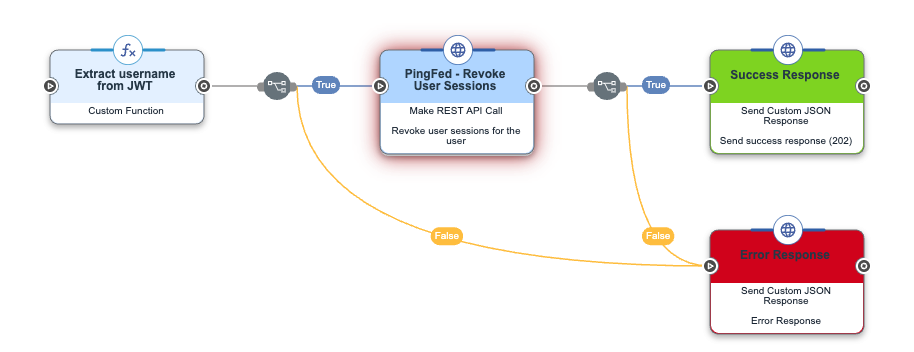

# Recipe: Forward CAEP Events to PingOne DaVinci

You can use `ssf-forwarder` to receive SSF/CAEP events in your PingOne DaVinci flows by creating a flow that is triggered by API call.

## Step 1. Create DaVinci Flow

1. Download our [example flow](./example-flow.json). We will use this as a template to get you started.
2. Navigate to [**Flows**](https://console.pingone.com/davinci/index.html#/flows) in PingOne DaVinci.
3. Press **Add Flow** then **Import Flow**.
4. Change the name or description if you wish, then press **Import**.

You should see a flow like the following:



This flow is very simple: it accepts events of type `https://schemas.openid.net/secevent/caep/event-type/session-revoked`, extracts the subject's username, and revokes that user's session at some theoretical PingFederate instance.

You can modify the flow to suit your use case. The "Extract username from JWT" node demonstrates how to parse and extract information from the Security Event Token that's passed from `ssf-forwarder`. You can modify the code for this node to extract the information you need from the token, then change the output schema to match.

## Step 2. Create DaVinci Application & Policy

Follow [Ping's documentation on launching a flow via API call](https://docs.pingidentity.com/davinci/integrating_flows_into_applications/davinci_launching_a_flow_with_an_api_call.html). Come back here once you have the invocation URL and API key.

## Step 3. Configure `ssf-forwarder`

Add the following sink to your `config.yaml`, replacing the placeholder values with your own:

```yaml
sinks:
  - type: webhook
    url: "https://orchestrate-api.pingone.com/v1/company/<YOUR_COMPANY_ID>/policy/<YOUR_POLICY_ID>/start"
    headers:
      "X-SK-API-KEY": "<YOUR_API_KEY>"
    body_template: |
      {"jwt": "{{.RawToken}}"}
```

## Done!

`ssf-forwarder` will now forward received CAEP events to your PingOne DaVinci flow.
